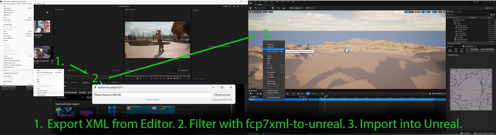
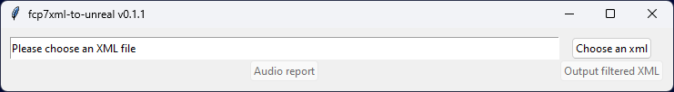

<p align="center">
  
</p>
<h1 align="center">FCP7XML to Unreal</h1>
<br></br>

 [](https://github.com/viacomcbs/fcp7xml-to-unreal/actions/workflows/python-package.yml)
[](https://viacomcbs.github.io/fcp7xml-to-unreal/)
[](https://github.com/viacomcbs/fcp7xml-to-unreal/blob/main/LICENSE)

`fcp7xml-to-unreal` is a utility for processing XML editorial output for import into Unreal Engine.

Edit shots rendered from Unreal Engine in your preferred editing software, export as XML, run the XML through this utility, then import the filtered XML into Unreal Engine to bring in the updates.



## Prerequisites

You will need [Python](https://www.python.org/) installed - all [supported versions of Python](https://devguide.python.org/versions/) should work.

## Quickstart

Install using [pip](https://pypi.org/project/pip/) or [pipx](https://pipx.pypa.io/stable/).

```bash
$ pip install fcp7xml-to-unreal
```

or

```bash
$ pipx install fcp7xml-to-unreal
```

This will provide the `fcp7xml-to-unreal` utility. Launch it by typing `fcp7xml-to-unreal` in a shell or terminal.



## Workflow

- Set up your narrative project using some shot naming and structure conventions. Show, Scene, and Shot are the default terms used here - see [film_language](./film_language.md) for details.
  - If configuring differently from the defaults, copy and edit a [config.yaml](../src/fcp7xml_to_unreal/config.yaml) file as needed. See [configuration.md](./configuration.md) for details.
- Render a movie for each shot (LevelSequence) from Unreal Engine, following the naming established in `config.yaml`.
  - The defaults provided assume a Show/Scene/Shot naming convention, where the movie rendered for Scene 02 Shot 003 of a Show named 101 would be named `101_02_shot_003.mov`.
  - **Note:** the name of the rendered movie file must match the name of the LevelSequence in the Unreal Project (101_02_shot_003.mov is rendered from a LevelSequence named 101_02_shot_003)
  - **Note:** the names of LevelSequences should be unique throughout the Unreal Project - this is how the movies are matched back to Unreal. Unreal does not enforce uniqueness of LevelSequence names, this must be managed manually.
- Import the movies into an editing application (Final Cut Pro, Adobe Premiere, DaVinci Resolve) and edit them together.
- If you are planning to use the Conform features of the utility, which helps teams transform a locked cut into a clean, consecutive numbering of Scenes and Shots, then add the Scene and Shot Burnin images on separate tracks above your movie tracks in your editing system. See [marking_shots.md](./marking_shots.md) for details.
- Export an XML representation of the cut from the editing application in the **FCP7 XML** format.
- **Process the XML with `fcp7xml-to-unreal`**.
- Examine the reporting information provided by the tool to help identify: shot naming inconsistencies, shots that have been manipulated by the editor in such a way that the Unreal version of the same shot will no longer match (such as retimed, scaled, rotated, etc.), and if using the Conform tools, Conform shot mismatches and numbering errors.
- Import the filtered XML into Unreal Engine (in the Level Sequence) to apply the edits to Unreal shots!

### Audio Report

The "Audio report" function produces a csv listing of all audio files used in the edit.

## Applications Tested

- Adobe Premiere Pro 26.0.0
- DaVinci Resolve 19
- Unreal Engine 5.1.1

Note: Other editing applications that can export Final Cut Pro 7 XML v5 XML should be usable.

## Changes

See the product [Change Log](https://github.com/viacomcbs/fcp7xml-to-unreal/blob/main/CHANGELOG.md) on GitHub for a history of changes.

## Problems?

Please submit [issues](https://github.com/viacomcbs/fcp7xml-to-unreal/issues) on GitHub.

## Want to contribute?

Details on the GitHub page: [https://github.com/viacomcbs/fcp7xml-to-unreal](https://github.com/viacomcbs/fcp7xml-to-unreal).
