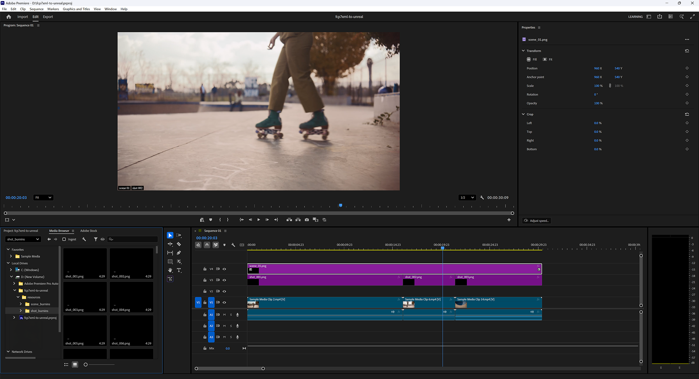

# Marking Shots

It is often the case that the naming/numbering convention used in the shooting process to generate a locked Show is not ideal for production. Specifically, production teams often seek sequentially-numbered and named Scenes and Shots for convenience, and rarely if ever will the shooting process generate such user-friendly data.

For example: consider shots 1, 2, and 3 that were delivered to an editor.
The final cut from that editor might feature pieces of those shots used in the following order:

2, 3, 1, 3, 1, 2, 3, 3

For convenience in production, this series of shots would be best renamed:

1, 2, 3, 4, 5, 6, 7, 8

We call this process Conforming.

The way this tool supports a Conform process is that editors can add sequentially-named Burnin image tracks above the existing shot tracks, identifying which Conformed Scene and Shot each of the original shots should be remapped to.

When the XML filter detects Burnins in addition to Shots and Scenes, it will pass on valuable reporting information to the user to help identify numbering inconsistencies, start/end frame mismatches, and so on.

Also, non-Shot items like leaders and breaks, and footage that does not correspond to a Shot in Unreal can be present in an edit - this approach removes them from the checking and syncing steps.

Some example burn-in images and a generator script are provided in [resources](../resources) for this project.
